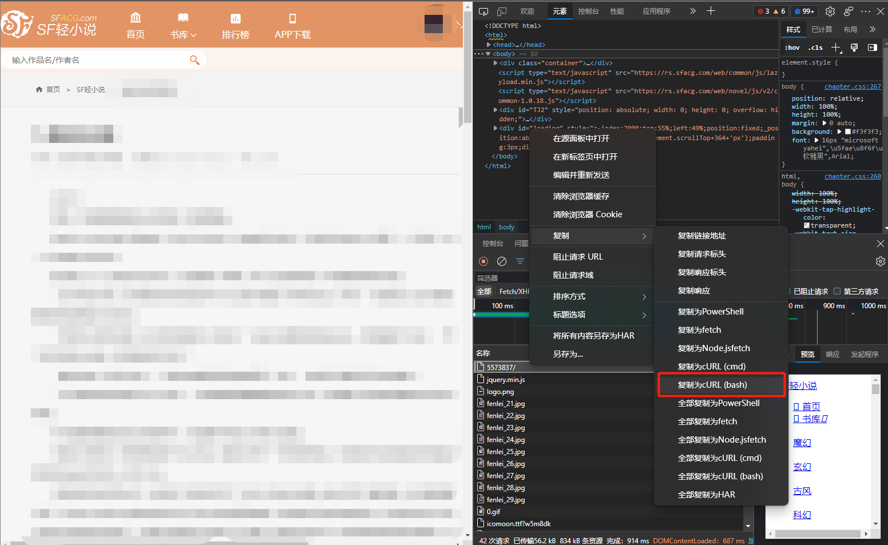

# SFacgDownloader
#### *菠萝包轻小说爬虫*

---
自用的菠萝包下载器，通过python获取网页端菠萝包的文章内容储存到本地，使用cnocr对vip文章做识别（当然识别率就不要提了，如果你有别的OCR可以直接把vimg中的图片导入）

### 环境配置

```bash
pip install -r requirements.txt
```

-   python==3.8 # 当然我只测试了3.8 其他的说不定也能用？
-   uncurl==0.0.11
-   cnocr==2.2.2.1
-   pillow==9.2.0
-   requests==2.22.0

### 使用方法

1.  打开菠萝包的某本书的某一章节（建议第一章），按F12复制cURL

    

2.  把复制到的内容粘贴到当前文件夹的request.txt中（我这里用vscode浏览的，其他文本编辑器都可以）

    

3.  直接执行SFacgDownloader.py

    ```
    python SFacgDownloader.py
    ```

4.  后面看着输入就好了

### 注：

该项目编写时间为2022.11.18，如果后续菠萝包修改了网页元素，将无法使用

## 请勿将该项目用于盗版用途！！！

### 鸣谢：

[Moe-MCU/SFacgSpider: 基于Python的自动化SF轻小说爬虫 (github.com)](https://github.com/Moe-MCU/SFacgSpider)

[RandyOrlando/SFacg-Book (github.com)](https://github.com/RandyOrlando/SFacg-Book)

[breezedeus/CnOCR: CnOCR: Awesome Chinese/English OCR toolkits based on PyTorch/MXNet, It comes with 20+ well-trained models for different application scenarios and can be used directly after installation. 【基于 PyTorch/MXNet 的中文/英文 OCR Python 包。】 (github.com)](https://github.com/breezedeus/CnOCR)

[spulec/uncurl: A library to convert curl requests to python-requests. (github.com)](https://github.com/spulec/uncurl)


